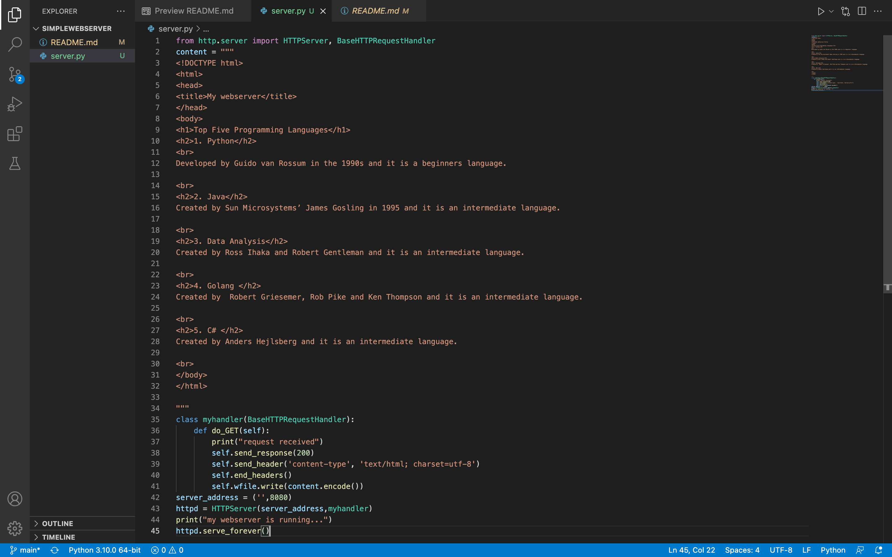
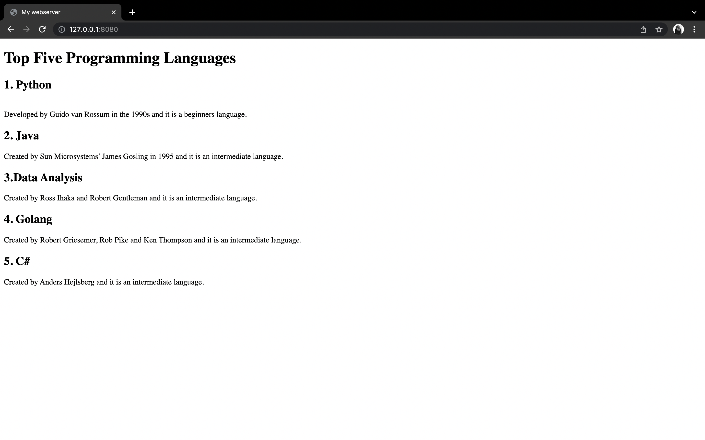

# Developing a Simple Webserver
## AIM:
To develop a simple webserver to display top five programming languages.

## DESIGN STEPS:
### Step 1: 
HTML content creation
### Step 2:
Design of webserver workflow
### Step 3:
Implementation using Python code
### Step 4:
Serving the HTML pages.
### Step 5:
Testing the webserver

## PROGRAM:
from http.server import HTTPServer, BaseHTTPRequestHandler
content = """
<!DOCTYPE html>
<html>
<head>
<title>My webserver</title>
</head>
<body>
<h1>Top Five Programming Languages</h1>
<h2>1. Python</h2>
 
Developed by Guido van Rossum in the 1990s and it is a beginners language.

 
<h2>2. Java</h2>
Created by Sun Microsystems’ James Gosling in 1995 and it is an intermediate language.

 
<h2>3. Data Analysis</h2>
Created by Ross Ihaka and Robert Gentleman and it is an intermediate language.

 
<h2>4. Golang </h2>
Created by  Robert Griesemer, Rob Pike and Ken Thompson and it is an intermediate language.

 
<h2>5. C# </h2>
Created by Anders Hejlsberg and it is an intermediate language.

 
</body>
</html>

"""
class myhandler(BaseHTTPRequestHandler):
    def do_GET(self):
        print("request received")
        self.send_response(200)
        self.send_header('content-type', 'text/html; charset=utf-8')
        self.end_headers()
        self.wfile.write(content.encode())
server_address = ('',8080)
httpd = HTTPServer(server_address,myhandler)
print("my webserver is running...")
httpd.serve_forever()

## OUTPUT:

### Server Side Output

### Client Side Output

## RESULT: Thus the webserver is developed to display Top five programming languages.
